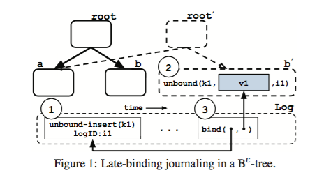

Optimizing Every Operation in a Write-optimized File System
=========
####FAST 16 Best Paper

这篇文章是基于作者自己FAST15的文章《BetrFS: A right-optimized write-optimized file system》进行的优化工作，BetrFS本身又是基于write optimized directory (WOD) 的一个通用文件系统。常见的基于inode的文件系统的目录管理是在目录文件里保存指向自己目录下文件的inode，这样如果我们要递归地遍历一个目录的话，对于每一个inode我们都需要做一次额外的random read，这对于那些需要大量range query的应用（比如数据库）来说是不可接受的overhead。同样，一次随机写入我们也需要先通过inode读取block number然后再进行操作，这样导致随机写入的性能也不令人满意。WOD就是为了解决这一问题提出来的方案，它的思路是将同一个目录下的文件的元数据连续地存放在一起，数据也是如此，这样在查询的时候我们只需要进行连续读取就行了。

BetrFS实现WOD是用的B-epsilon树，具体细节在FAST15的论文里，这儿只简单介绍下了解本篇论文需要的内容。B-epsilon树的实现基于B树，但是它存储的内容除了数据本身以外，还包括每次操作对应的message。它在每个节点上留出了B*epsilon的空间用于缓存message，每个message是个（key，operation）的pair，而这个key是属于某个子节点的。当缓存空间已满时，该节点就把占用空间超过平均缓存大小的message给flush到它应该属于的子节点去，子节点根据message内容决定自己是apply这个message（如果key存在自己节点上），或者缓存该message知道再该flush到自己的子节点（该key存在自己的子节点上）。B树将range query处理成了连续读取，而message以batch的方式flush让insert操作耗费的时间只有原始B树的1/。但是这种WOD的实现是以牺牲rename和delete的速度达到的。在inode的文件系统里，对文件更名只需要更改它所在目录的inode中的相关条目，但是在B-epsilon树里，我们还需要把数据也移动到以新的文件名为key的位置。对目录更名更是需要移动该目录下的所有内容。同样的，delete在B-epsilon树里也需要在树里查找所有的节点并进行删除，而inode则只需要删除该inode并更新free map即可。Betrfs 0.1还有个问题是使用write-ahead-log来保持写入操作的一致性，导致写入的throughput减半。

为了解决这些问题，Betrfs使用了late-binding journaling, zoning和range deletion的设计。Late-binding journaling是将zfs的journal方法移植到B-epsilon树上的实现，本质上都是先将数据写在一个地方，然后日志文件里面只需要记录新数据的指针，最后commit的时候讲指向旧数据的指针指向新数据，从而实现atomic的操作。B-epsilon树因为写入的是message，而不是可以直接进行覆盖的数据，因此先在日志里用unbound-insert记录下该message的key和logID，然后将message插入B-epsilon树。在插入结束后再在log里append一个bind的操作，将logID和message所在的node的指针联系到一起。将log持久化到磁盘的时候，我们也将所有被bind的node也写入磁盘，此时由于原来B-epsilon树的指针还没有指向新的node，因此原来的checkpoint不受影响，始终保持consistent。而在出现failure的时候，根据log我们能找到新写入的数据，并且通过对应的unbound-insert和bind能进行重放。没有bind的node则认为操作没有完成，对原来的数据不造成影响。这样我们就能在只进行一次写入的的情况下进行保持数据一致的log了。可能丢失的数据只有在每次flush log间隙中写入了内存但没写入磁盘的内容，而这个间隙通常只有1s。

zoning是用来加速rename的技术。更准确地说，是用来在search和rename的速度之间进行平衡的技术。Betrfs将文件/目录分成不同的zone，每个zone都包含个目录树，但是zone里的叶节点可能是B-epsilon树的中间节点。对于文件metadata或者data的定位使用zoneID和该文件在zone内部的相对位置，同一个zone内的metadata和data都在磁盘上储存在一起，因此在读取的时候可以一次顺序读取全部读出来。Zone的划分满足两个限制，Zmax和Zmin，当一个zone内有文件或目录的大小超过Zmax的时候，就将它分离出来成为一个新的zone，而当一个文件/目录的大小小于Zmin的时候，则被merge进它的父节点。为了防止cascade，我们只在父节点不会split的时候才进行merge。在按zone以相对位置储存数据后，如果我们要对一个zone的根节点目录更名，我们只需要删除它的父节点所在的zone中的对应的metadata，并在新的名字应该存放的zone中插入一条指向原始zoneID的新的metadata条目就行。我们不用再将该zone内部的数据也全部移动到新的目录下。至于search，以前所有数据都是连续存放的，因此一个recursive scan只需要一次连续读取，现在我们在zone内部是连续读取，而跨zone的操作会需要一次随机读取。只要我们将zone的大小设计合理，这个多余的随机读取带来的性能损失基本可以忽略，我们仍然可以以接近磁盘带宽的速度进行scan。Zone同样也大大加快了unlink的速度，因为unlink操作需要删除的内容也被限制在了一个Zone的范围内，超出zone的内容会因为reference counter变为0而被自动清除。

range deletion看名字就知道是为了加快delete/unlink的设计。思路很简单，以前的delete的参数是文件名和block ID，range delete的参数则是文件名，起始blockID和终止blockID，这样以前删除一个大文件我们需要插入大量的delete message，现在只需要一个从0到infinity的range delete message就行了。但是实现上有不少细节需要注意。由于key变成了一个范围，因此这个message可能会跨越不同的子节点，在其中一个子节点的message需要flush的时候，这个range delete需要split成几个范围更小的message，其中只有该子节点对应的各部分被flush。这个split需要保持原始message的顺序，现在的实现是简单地将range delete单独存储在一个list里，具体的commit order在节点处理的时候自行解决。Range delete同时也能用来加速large sequential write。在Betrfs 0.1中，每个write操作都需要先读取原始block内容，apply这个insert的message，再写回。然而对于全文件的overwrite来说，我们能够确定以前的数据都会被覆盖，因此这个读取操作是没有必要的。但是由于insert操作都以block为单位，节点在处理的时候不能分辨这是否是一个overwrite，因此我们在进行写入前先对要overwrite的数据进行range delete，这样在接下来写入的时候由于该节点不存在，我们可以直接写入，而不需要再进行重复读取了。

评测包括对Zmax，Zmin取值对recursive scan和rename性能的影响，在Zmax=Zmin=512KB时Betrfs 0.2与其他文件系统btrfs，ext4，xfs，zfs在rename，unlink，file creation和large file IO上的性能对比，以及和这些文件系统在一些实际应用比如git，tar以及一些标准文件系统benchmark上的性能对比。可以看到，Betrfs 0.2保持了Betrfs 0.1在scan和random write上数个数量级的优势。

而在rename和large file IO上新的0.2都比0.1有了长足的提高，达到了和其他通用文件系统类似的性能。

在以前是短板的unlink上，Betrfs 0.2反而由于zone和range delete的设计而变得比其他文件系统更快了。

而且Betrfs 0.2的unlink操作和文件大小基本无关，因此在大文件的时候优势更加明显。当然，不令人以外的是，在只需要读取数据的grep操作上Betrfs 0.2比0.1慢了一些，但优势相对其他文件系统同样明显。在具体应用上的结果也和上面的micro benchmark的结果相符。

Betrfs 0.2说明了WOD并不是只能用在一些需要随机写和range query的数据库实现里，而是同样能够在不影响其他操作的时候用来实现一个高速的通用文件系统。粗看起来这篇文章使用的技术其实都不是非常新颖，zoning的实现和cephfs的metadata server用来分配metadata进行load balance的方法类似，late-binding journaling的技术直接来源于zfs，只是针对B-epsilon树进行了具体实现，range delete则是针对unlink瓶颈进行的直观的优化处理。然而能够发现一个系统中所有操作的瓶颈并分别找到最新的解决技术，在不同技术对不同操作的tradeoff中找到一个平衡，然后实现出一个高速可用的系统，还是颇有难度的事情。这个系统可能能进一步优化的点可能在于当前对ext4的依赖。现在Betrfs中B-epsilon树和journal都是是使用ext4的文件来实现的，因此很多操作也受到ext4的性能影响。Ext4中一些对Betrfs没有必要的metadata操作和一些自带的重复的功能都可能给进一步的优化带来困难。如果能针对基于不同的底层文件系统的性能做出分析，或者直接在raw的磁盘上实现文件系统，可能能获得更有说服力的结果（不过也需要更大的工作量）。
