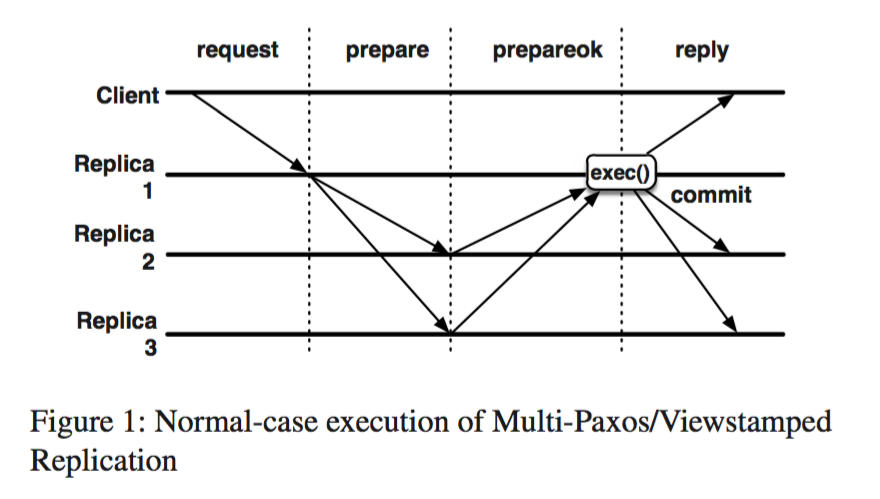
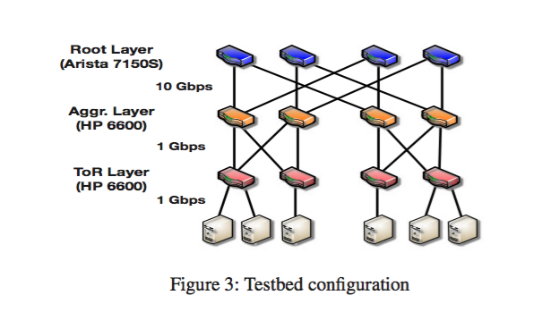
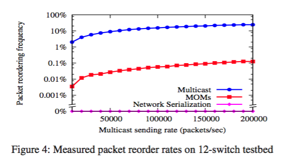
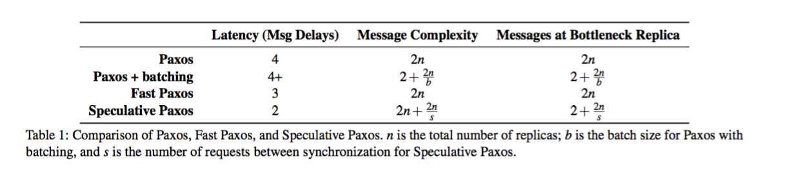
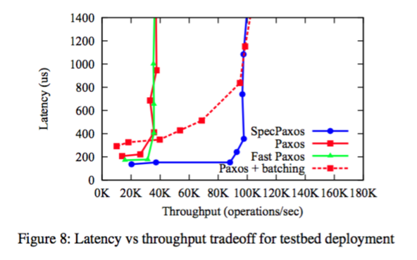
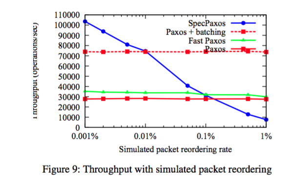

Designing Distributed Systems Using Approximate Synchrony in Data Center Networks
=====
####NSDI 2015 Best Paper
分布式系统中使用的算法通常都是独立设计出来的，并没有考虑底层系统在性能或者功能上的特性，因此很多时候并不能充分的利用现在底层系统的优化。比如paxos作为最常见的同步备份算法，设计的假设是消息可能任意的延迟、丢包或者重排，但是在现代的data center里，由于高度可控的软硬件设施可以提供足够的可靠性和灵活性，我们能够让消息的传输远比Paxos的假设要可靠。这篇论文就基于SDN设计了一个mostly-ordered multicast（MOM）的广播策略，能够让同一个multicast group的消息接受顺序以极大概率保持一致，然后利用这一性质提出了优化的speculative paxos，在throughput和latency上都比传统独立设计的算法得到了提高。

传统的Multi-Paxos或Viewstamped Replication算法需要4轮消息传输才能向客户端返回结果，而且因为所有的消息都要经过当前的leader，作为leader的机器很容易成为性能瓶颈。即使是优化过的Fast Paxos也需要3轮信息传输。这些额外的消耗都是因为假设消息传输是不可靠的，因此我们必须要由leader来决定顺序。因此，一个可靠地广播策略能够让我们避免这些多余的操作。然而在当前的data center架构里，为了防止单个交换机/链路导致机器不能访问，我们通常都会利用冗余来以防万一，因此两个点间可达的path可能有很多条。而且常见的Fat Tree的分层的设计也让不同机器间的path长度不同，因此对同一个multicast group来说，来自两个不同client的消息很容易以不同的顺序到达两台不同的机器。
为了解决reorder的问题，这篇文章提出了三种解决办法：

-让同一个client到达multicast group里每台机器的path长度相同。
-将multicast具有高优先级。
-针对同一个multicast的消息都由同一台root switch进行排序。

第一点解决了path长度不同导致传输时间不同从而造成的reorder。在Fat Tree的结构里，我们只要让消息先到达这个multicast group的共同的父节点交换机们，然后再向下传输，就能保证path的长度一致。这个方法会让某些离目标机器比较近的client无法选择最短路，然而大部分消息本来就需要走这个长的路线，因此平均的延迟影响应该不大。这个方案可以基本保证在网络负载小的时候不发生数据包的重排。针对网络负载大时不同path的阻塞程度不同导致的传输时间不同，第二点保证了multicast消息能够在队列里优先被处理，因此传输速度能够不太受到网络拥堵的影响。最后第三点让同一台root switch负责将multicast的消息发送到对应的机器，只要这台switch能够保证它向每台子交换机发送的multicast的顺序是一致的，而子交换机也能保证这一性质的话（一般也应该保证），那如果没有链路或者机器的failure，我们应该能100%的保证数据顺序的一致性。第三点可能导致的问题一个是利用同一台root switch的话可能浪费网络本身load balance 的特性导致成为热点，但是一般的系统里需要运行大量的replication cluster，如果我们以哈希的方式分配root switch，出现热点阻塞的概率很小。另外一个问题是这台root switch在fail过后的处理。我们可以让SDN的controller在发现failure后通过调整转发策略指定一台新的root switch，也可以在一开始就对每个multicast group指定多个排好序的root switch，这样client可以在自己发现switch failure或者timeout过后选择一台新的switch。第二种解决办法需要维护更多的转发表，但是fail over的速度更快。

	作者使用5台交换机对实现的策略进行了emulation，网络结构如图。

我们在下图可以看出，原生的multicast的reorder概率相当高，但是简单的MOM（使path长度一致）就能将reorder的概率减小几个数量级，而使用同一台机器进行serialization则能够基本排除reorder的情况。

作者接着simulate了119台switch和2560台机器，结果也类似。

基于这一MOM的网络，作者提出了speculative paxos的算法。Client通过invoke（）直接向需要replication的group发送multicast。在通常情况下，server处于normal状态，对client的请求进行speculativelyExecute，对操作记录sequence number，将操作进行log并且标记为speculative，然后将结果发送给client。这个结果里面也包括当前服务器的summary hash 

summaryn = H(summaryn−1 || operationn)

如果两个summary相同，我们可以认为这两个服务器具有相同的操作历史。Client在接收到super quorum的结果后开始比较大家的summary，如果summary都相同，则认为该操作已经成功，向invoke返回结果。在这一过程中，只有两轮的消息传输，而且消息直接通过client和server，不存在bottleneck，可以说是达到了最优的情况。

在服务器端，类似VR算法，每个服务器都维护着自己当前的view number，而且当前view v的leader就是v mod n（n是服务器的数目）。Leader会周期性地像所有服务器发送sync的请求，并且带上当前的view number v和最高的sequence number s。收到请求的服务器则返回自己的view number，highest sequence number和summary。在收到super quorum的返回值过后，如果leader发现大家的summary都相符，那说明当前log中的结果都能得到一致，于是把这些log标记为committed，并且发送给其他replica。

如果client发现有服务器返回的summary不同，则代表有服务器接收到的消息发生了reorder导致它的操作顺序与其他服务器不同，因此Client向所有服务器发送start-reconciliation的请求，并且带上当前view number+1.接收到这个消息的服务器如果发现自己的view number比收到的小，则进入reconciliation状态，将自己的更新到最新的view number并且向其他服务器也发送这条消息，在此期间服务器不再处理client的请求。当一个服务器收到了f条来自其他服务器的消息过后，则认为当前reconciliation已经开始，于是把自己的log，最近处于normal状态的view number和最新的view number都发给leader。Leader在收到来自f个服务器的reconcile请求后，开始用收到的这些log组合出一个一致的log。只有具有最新view number的log被leader利用，组合的过程优先保证大多数log具有的共同前缀得到保留，同时也保证所有出现过的entry都能被保留下来。

如果有机器fail过后要恢复，或者需要添加删除机器，speculativePaxos都使用类似Viewstamped Replication的方法，只要能保证fail的机器数目数量小于f就行。

这个协议能够保证在不超过f台机器的时候所有replica的状态保持一致，证明不在此赘述。这儿MOM只是用于提升性能，系统的正确性仍然不依靠于数据传输的顺序，speculativePaxos只是通过增加出现reorder时候的解决问题的复杂度来减少平时不出现reorder时候的复杂度。SpeculativePaxos与其他系统的对比如下，可以看出在正常运行时的latency和throughput这两方面SpeculativePaxos都做到了最优。而由于reorder极低的出现率，它在实际运行中的性能也同样出众。

emulation测试基于之前MOM同样的配置，结果如下。不出乎意料，paxos+batching和speculativePaxos达到了同样的throughput，因为它们都避免了单点leader成为throughput瓶颈的情况。SpeculativePaxos同样也在所有情况下都具有最低的latency，这是因为它将消息传输的轮数减小到了2.

这个测试是基于MOM把reorder的概率减小了数个数量级过后的，要清楚speculativePaxos在平常状态和解决冲突状态下进行的平衡，我们需要知道它在不同reorder概率下的表现。

可以看出，虽然性能随着reorder概率提高下降得挺快，但是在reorder概率小于0.01%时specPaxos保持对paxos+batching的优势，而在0.1%一下的时候都能比FastPaxos和Paxos有着更高的吞吐量。我们的serialization的实现能够基本保证reorder概率为0，因此这个协议确实是完全基于我们底层的网络转发的优化来实现的。

这篇文章从大方向来说，在分布式系统里根据底层优化来设计具有针对性的算法的想法相当具有启发性，而具体通过优化multicast reorder概率来改进paxos的实现也做得效果非常不错。可能的问题在于作者的工作基本都是基于FatTree的网络拓扑结构做的，在其他结构里的实现仅仅随口提了一下，这个思路能否以同样小的代价在其他拓扑里获得这么高的性能提升还值得讨论。

