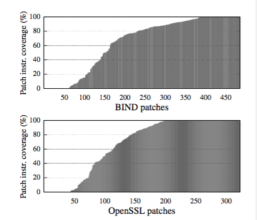
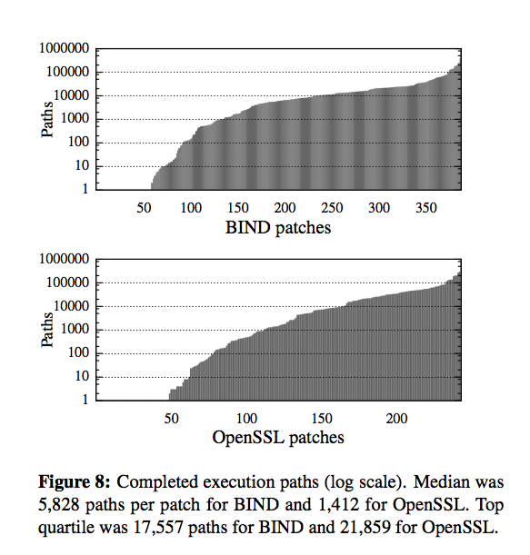
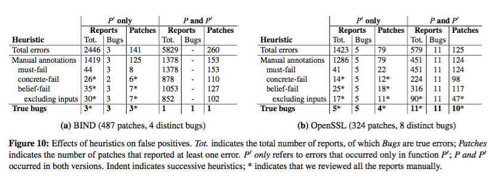
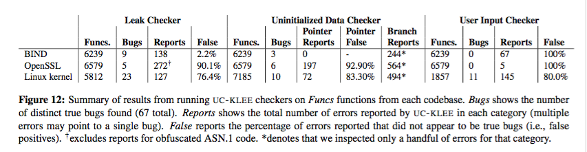

Under-Constrained Symbolic Execution: Correctness Checking for Real Code
====
####SECURITY 2015 Best Paper

程序分析在保证程序正确性方面有着重大的意义，而symbolic execution通过根据程序逻辑考虑所有可能的输入来遍历运行分支，能够发现一些程序员难以注意到的bug。然而由于对于每个分支运行路径都会成倍增加，因此这种方法在程序规模比较大的时候会面临可扩展性的问题。这篇文章基于以前作者们实现过的针对小规模模块调用进行检测的系统，提出了UC-KLEE，一个针对函数进行分别symbolic execution检测的新系统。

由于UC-KLEE的检测范围以函数为单位，因此程序的运行复杂程度得到了限制，可以在设置递归上限的情况下对一个函数进行比较完善的分析。但是将一个程序分散为不同的函数进行分析的话，我们会丢失一些函数之间互相调用的信息。比如函数参数在调用前已经进行了限制，但是我们在单独分析一个函数的时候由于不知道这个限制，可能会报告出false positive的bug。作者们主要针对这种情况进行了很多优化，使得最后分析出来需要人工判断的错误数量足够小。基于这一系统，作者们先对一些系统的patch进行了分析，找出了可能引入程序崩溃的patch。接着利用这一系统对其他完整的大型程序进行了分析，并且找出了一些以前没有找出的bug。

UC-KLEE采用lazy initialization的方式构造输入，避免了人工测试的重复劳动。在分析过程中，对于每条运行路径，系统维护着两个状态：path constraint和symbolic input。第一个是用来表示当前路径在分支选择上需要满足的条件，第二个则对是我们根据分支选择构造出来的输入。特别是需要对输入的指针解引用的时候，我们需要实时地分配出一块空间作为输入的对象，而对于类似链表之类的结构，由于不能提前预知链表的长度，我们更是需要不断的构造新的节点。具体说来，所有输入的参数在一开始都处于unbound的状态。在面临条件判断或者分支选择的时候，我们先根据已有的symbolic input看是否能直接作出决定，如果不能，则记录下分出的两条执行路径，分别在path constraint里添加分支的条件。如果这一判断依赖于输入的值，我们则在对应的symbolic input里进行将它设定为满足这一条件的值。这里如果需要设定的输入值是对输入指针解引用出的对象的属性，我们有两种lazy initialize对象空间大小的方法。一种是先对当前状态进行checkpoint，然后固定一个值作为对象的大小，如果在后面对该对象的访问越界了，我们再回到之前checkpoint的点重新设定对象大小使得访问不越界。另一种方法是将对象的大小也设定为一个symbolic value，这样在访问的时候，我们根绝越界或者不越界将执行路径分支，设定不同的path constraint和symbolic input。需要注意的是，这一symbolic execution的方法由于自己lazy initialize不同的对象，因此预设了这些对象之间没有关系，也就是指针各不相同，也没有循环引用的数据结构。如果程序依赖于判断两个对象的指针是否相同的运行逻辑，UC-KLEE将始终判断为假。

有了symbolic execution的方法，我们可以开始对patch进行验证。UC-KLEE通过找出在原来函数中不报错而在打了patch过后的函数中报错的执行路径来发现bug。由于检查的单元是函数，而对象是symbolic input，因此这种检查方式不适用于改变了对象数据结构的patch。对于给定的原始函数P和打了patch的函数P’，我们先使用under-constraint的输入运行P’，找出会导致程序错误的分支及其对应的symbolic input，接着清除在这一过程进行的所有操作，将同样的输入传递给P，看是否会报错。由于我们先运行P’，因此实际上我们能够提前做好很多剪枝操作，让实际运行在P上的输入的集合大小变得可以接受。首先我们不再在P上运行不会在P’上出错的输入，因为即使运行结果不一样，也代表着新的patch解决的一个bug而不是引入了一个bug。对于会产生错误的输入，一种操作是通过LLVM的control flow graph分辨出在P和P’中basic block相同的路径，并将这些输入除去。另一种操作则更关注错误产生的原因，在产生错误时我们记录下错误指令的program counter（PC）和错误类型。如果两条路径的PC和错误类型都相同，代表它们引起的是同一个错误，这个错误是否会被P同样产生只需要一条路径就可以检验了，因此我们删去其他的路径。

为了检验这一系统的效果，作者们选取了BIND和OpenSSL最近一年的所有commit。这里一个patch指一个针对单个函数的改动，因此一个commit可能带有多个改动。他们从中挑选了可以用UC-KLEE来分辨的BIND的487个patch和OpenSSL的324个patch，不能被分辨的即编译后字节码相同的、改变了数据结构的、只是删除不再使用的代码或者只添加unit test等的。最后找到了BIND的4个bug和OpenSSL的8个bug，其中只有OpenSSL的2个bug是以前发现过的，其他的10个bug都是新发现的。

作者使用的参数是最多生成9个symbolic object，以防在数据结构里无限递归。对于单个patch的运行时间是一个小时。在这些patch里，67（13.8%）个BIND的patch和48（14.8%）个OpenSSL的patch做到了遍历所有可能的execution path。另外一个evaluate的指标是这个过程涉及到的指令占总指令的比例。对BIND来说，这个指标的中位数是90.6%，而对OpenSSL来说是100%。只有6个BIND patch和1一个OpenSSL patch的指令覆盖率小于2%。由于我们分析的是这个patch的正确性，更好的指标应该是P’里与P不同的指令被UC-KLEE覆盖的比例。在BIND和OpenSSL里的中位数分别是81.1%和86.9%。更具体的数据见下图。

作者还统计了每个patch我们测试的path数目，用来表示系统的运行性能，具体见下图。

虽然看起来系统能做到不错的覆盖率，但正如我们一开始说的，单独分析各个函数最大的问题是可能带来的更高的误报率。作者对这个问题也提出了多种解决办法。一种是进行手工标注，标注包括两种，data type和function call，都用C语言标注。Data type就是对输入数据的强制规定，比如buffer的长度小于length，这个规定会在路径执行完毕过后起效，如果path constraint不满足这一规定，则这一path被判定为无效，不会把错误报告给用户。Function call则是软性的剪枝条件，在函数执行前系统会尝试添加这一条件到path constraint里，如果没有矛盾则添加成功，否则忽略这一条件。Function call可以认为是对调用函数方式的乐观期望，减少了我们认为不会发生的错误被输出的数量，但是不会防止一定存在的错误，而data type则是一定会满足的条件，如果违反了data type的条件代表是UC-KLEE对函数分开判断导致的误报。

除了手工标注以外，系统还会使用启发式算法进行自动判断。算法有3种，must-fail，belief-fail和concrete-fail，分别对应会对所有输入产生的错误，会对一部分特定输入产生的错误，和由non-symbolic的条件产生的错误。在这些过滤方法过后，系统一共输出了60个错误，BIND的98.6%和OpenSSL的98.2%的错误都被排除掉了。这里面有12个被人工确认为真的bug，虽然看起来误报率不低，但是剩下的错误数量相比起原来的811个patch来说已经完全可以由人工来处理了。

!(automate)(image/automate.png)

除了对patch进行检查以外，UC-KLEE也提供了rule-based checker来对一个完整的系统中的单个函数进行检查。这里最大的问题是该函数调用的其他函数不一定有LLVM编译的代码用于检测。这里UC-KLEE对该函数的行为进行under- approximates，也就是认为该函数会趋向于令错误不产生。比如向一个函数传递一个堆上的对象指针，我们认为该函数返回后不会保留指针导致内存泄漏；或者在向一个函数传递指针过后，我们认为该指针在函数内部被初始化了，因此以后再对其解引用就不会报错。这样我们找出的错误都是确定的，而不会依赖于其他函数的实现，虽然可能错过一些bug，但是也足够找出程序员自己发现不了的错误了。最后作者在BIND，OpenSSL和Linux kernel上测试得到的结果如下：

这篇文章提出了以函数为单位对patch或者一个完整系统进行正确性检查的方式。虽然对patch的测试的结果更可靠，但是感觉更重要的是这一思路使得在复杂的大型系统中进行测试的方法变得可行。不过在整篇文章中到处都写着当前实现在各个方面的局限性，还远不到能够对系统进行验证的程度，然而作为一个对手工构造参数进行代码测试的补充或者替代方案，应该能大大提供系统的可用性。

